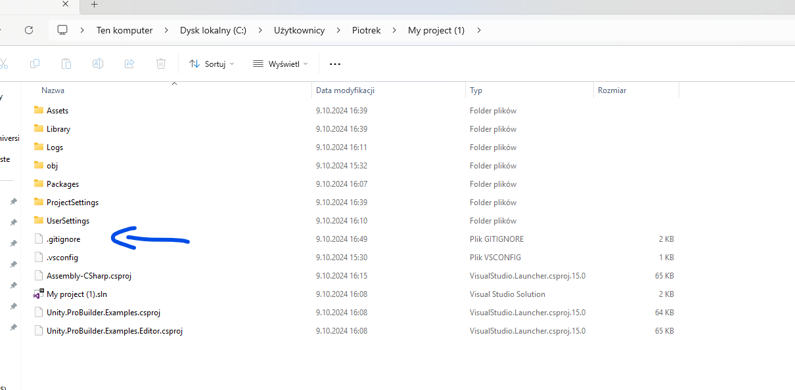
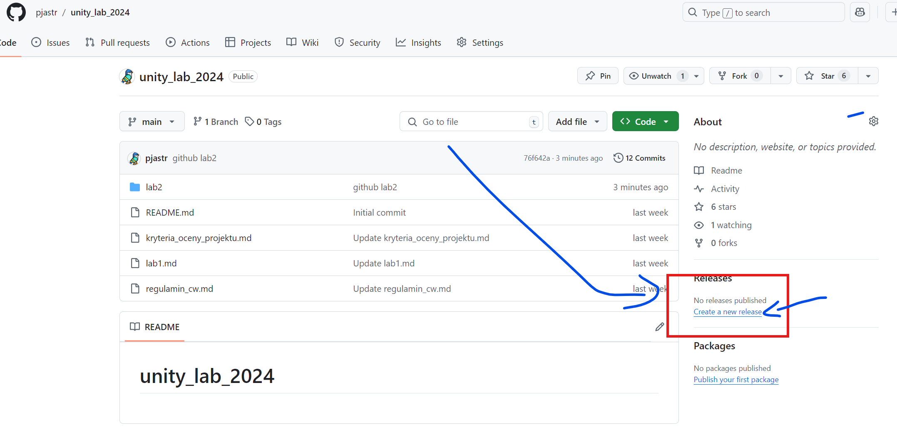
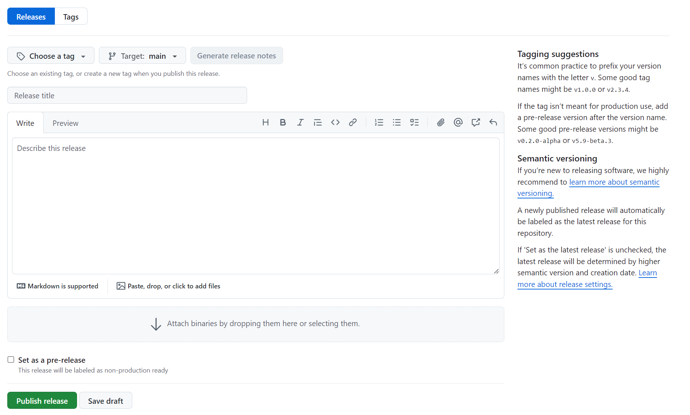

# Unity a Githuba

# Przesyłanie projektów Unity na Githuba

Aby przesłać projekt Unity na Githuba (z uwagi na limit plików), należy
do projektu dodac plik `.gitignore`. Do pobrania tutaj
<https://github.com/github/gitignore/blob/main/Unity.gitignore>.

Plik powinien być dodany na poziomie głównego katalogu projektu Unity.

**Ważne. Plik musi składać się z samego rozszerzenia!.**

Przykładowy wygląd projektu.

Częste błędy:

- przesyłanie samego katalogu Assets
- brak kompilacji projektu. Przez zakomitowaniem zmian zaleca się
  zamknąć i zapisać pracę w Unity/Visual Studio.
- Umieszczanie buildu bezpośrednio w repozytorium git.

# Publikacja buildu (realease) na Githubie

Dla większości kod i standardowych repozytoriów na Githubie dostępna
jest w przeglądarce sekcja Releases gdzie powinny publikowane build
(pliki wykonywane aplikacji, nie tylko gier).

Plik wykonywalny powinien zostać spakowany w archiwum (np. dla Windows
zip - rar na uczelni nie jest zalecany, dla linuxa np. tar itp itd).

Potem do wypełnienia jest prosty formularz:

Więcej informacji o semantyce wersjonowania <https://semver.org/>.
