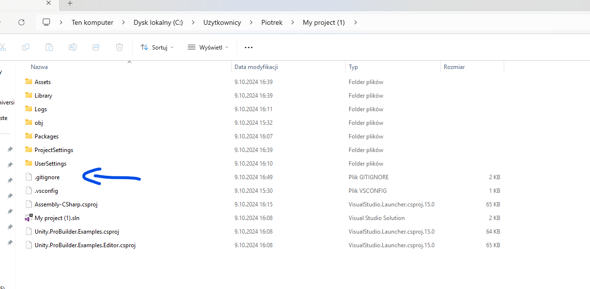

# Przesyłanie projektów na Githuba

Aby przesłać projekt Unity na Githuba (z uwagi na limit plików), należy
do projektu dodac plik `.gitignore`. Do pobrania tutaj
<https://github.com/github/gitignore/blob/main/Unity.gitignore>.

Plik powinien być dodany na poziomie głównego katalogu projektu Unity.

**Ważne. Plik musi składać się z samego rozszerzenia!.**

Przykładowy wygląd projektu.

Częste błędy:

- przesyłanie samego katalogu Assets
- brak kompilacji projektu. Przez zakomitowaniem zmian zaleca się
  zamknąć i zapisać pracę w Unity/Visual Studio.
