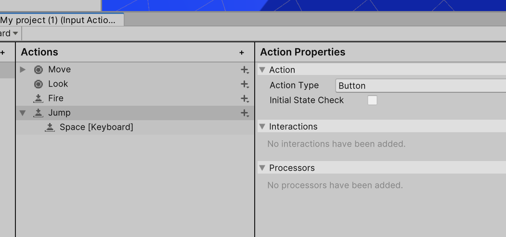

# Laboratorium \#2

- Unity a Githuba [github.md](github.md)
- Podstawy modelowania 3D za pomocą Probuildera
  [modelowanie-probuilder.md](modelowanie-probuilder.md)

## Ścieżka programistyczna

Probuilder a kodowanie

https://docs.unity3d.com/Packages/com.unity.probuilder@4.0/manual/api.html

## Zadanie dodatkowe (1-2pkt)

- Stwórz scenę (może być nowy projekt lub dotychczasowy) w którym
  stworzyć model fragmentu rzeczywistości.
- Dodanie gracza (kulka lub kostka) z prostym skryptem poruszania.

Pomocnicze skrypty: [PlayerController.cs](PlayerController.cs)
[CameraController.cs](CameraController.cs)

Dodanie inputa do skoku:

- Opcjonalnie można uzupełnić obiekty teksturami (po rozpakowaniu pliku
  wystarczy przeciągnąć i upuścić na katalog Assets).

Bezpłatne tekstuty można znaleźć np. tutaj:
<https://itch.io/game-assets/free/tag-textures>

- Opcjonalnie dodatkowo 1pkt: część implementacji modelowania za pomocą
  kodu.

Wybrane tutoriale:

- https://www.youtube.com/watch?v=YtzIXCKr8Wo
- https://www.youtube.com/watch?v=cOSxvvnGnuM&list=PLs_yJ-RML1YeM2KbHbVKh50CkwINm-biV
- https://www.youtube.com/watch?v=ElNfaUFpqmc&list=PLuVz-FGt23yLxDo1bjaFoslJoS3Ds5Iw\_
