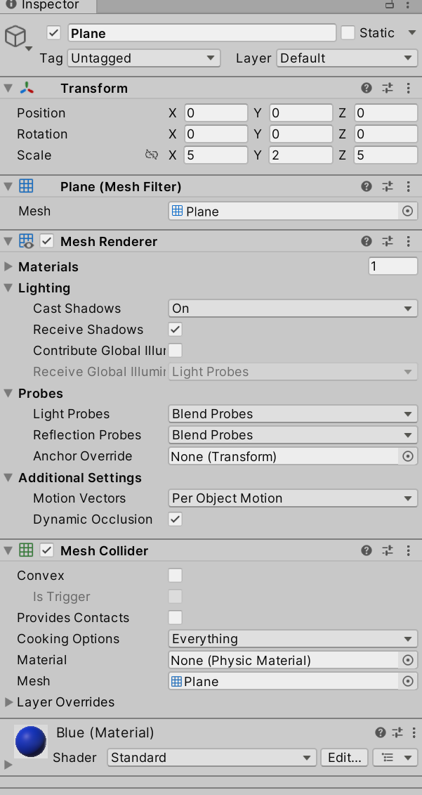
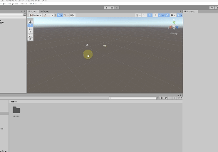

# Podstawy modelowania w Probuilderze

# Modelowanie

Modelowanie w kontekście technologii multimedialnych, szczególnie w
środowisku Unity, obejmuje tworzenie cyfrowych reprezentacji obiektów,
postaci oraz środowisk, które są wykorzystywane w grach, symulacjach,
aplikacjach VR/AR i innych projektach multimedialnych. Proces ten jest
kluczowy do budowy interaktywnych i realistycznych scen, ponieważ modele
3D stanowią podstawę wizualną i funkcjonalną tych aplikacji.

# Obiekty gry (ang. gameobject)

Obiekt gry (ang. GameObject) w Unity to podstawowy element, z którego
zbudowana jest każda scena w grze. Jest to kontener dla komponentów,
które definiują zachowanie i właściwości obiektu w grze. Obiekty gry
mogą być organizowane hierarchicznie, tworząc strukturę rodzic-dziecko.

Transform w Unity jest komponentem, który przechowuje i zarządza
pozycją, rotacją oraz skalą obiektu w świecie 3D lub 2D.

Mesh Filter w Unity jest komponentem, który służy do przechowywania
siatki (mesh) modelu 3D i przekazywania jej do renderera, aby mógł
wyświetlić obiekt w grze. Jest to podstawowy element pracy z obiektami
3D w Unity, ponieważ pozwala na przypisanie modelu 3D do obiektu w
scenie.

Mesh Renderer w Unity jest komponentem odpowiedzialnym za renderowanie
(wyświetlanie) obiektów 3D w scenie. Działa on w połączeniu z
komponentem Mesh Filter, który dostarcza mu siatkę (mesh) obiektu do
wyrenderowania. Mesh Renderer zajmuje się stosowaniem materiałów,
tekstur oraz innych efektów wizualnych, aby siatka była widoczna w grze.

Collider w Unity jest komponentem fizycznym, który definiuje kształt
obiektu 3D lub 2D używany do wykrywania kolizji. Jest niezbędny do
interakcji fizycznych w grze, takich jak kolizje między obiektami,
wykrywanie wejścia gracza na platformę lub reagowanie na ataki. Collider
działa razem z innymi komponentami fizycznymi, takimi jak Rigidbody, aby
symulować realistyczne interakcje w świecie gry.

# Probuilder

Instalacja opisana jest tutaj
https://docs.unity3d.com/Packages/com.unity.probuilder@4.0/manual/installing.html

Dla projektów URP i HDRP trzeba zainstalować jednej z sampli.

Animacja dla 3D (Built-in Render Pipeline):

