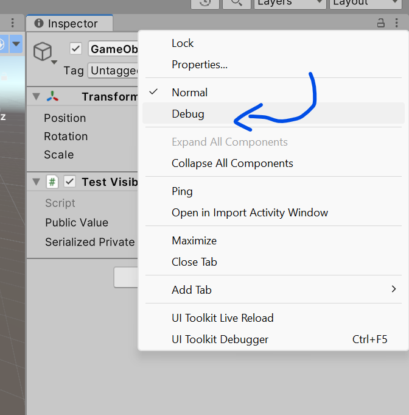

# Laboratorium \#3

# Podstawy skryptowania w Unity

## Do przejrzenia materiały do samego języka C

- podręcznik z UE z Katowic <https://c-sharp.ue.katowice.pl/?page_id=36>
- “moje” stare wykłady z ZPO
  <http://wmii.uwm.edu.pl/~piojas/index.php/2020/01/29/zaawansowane-programowanie-obiektowe-wyklad-s-stac/>

## Skryptowanie w Unity

- [skryptowanie.md](skryptowanie.md)
- [dokumentacja API Unity](https://docs.unity3d.com/ScriptReference/)

## Ustawienie w Unity konkretnego edytora

Edit/Preferences/External Tools

------------------------------------------------------------------------

Dalsze ćwiczenia wykonuj w oddzielnych scenach w jednym projekcie.

## Ćw \#1 - hermetyzacja, serializacja

1.  Stwórz pusty obiekt gry.
2.  Dodaj do niego komponent nowego skryptu o nazwie TestVisibility.
    Skopiuj zawartość z odpowiedniego pliku z repo. Przeanalizuj kod.
    [TestVisibility.cs](TestVisibility.cs)
3.  Włącz tryb Debug dla inspektora. **Uwaga - ten tryb należy
    wykorzystywać w bardzo wyjątkowych sytuacjach.**

## Ćw \#2 - atrybuty

1.  Stwórz nową scenę, dodaj nowy pusty obiekt gry i przeanalizuj
    poniższe skrypty podpięte pod ten obiekt:

- [TestAttributes.cs](TestAttributes.cs)
- [ContextMenuExample.cs](ContextMenuExample.cs)
- [RequireAndDisallowExample.cs](RequireAndDisallowExample.cs)

## Ćw \#3 - właściwości (propercje)

1.  Stwórz nową scenę.
2.  Dodaj kulkę i płaszczyznę, inputy jak poprzednio i skrypt
    PlayerController z poprzedniego labu.

Przeanalizuj teraz zmiany w pliku
[PlayerController.cs](PlayerController.cs)

## Ćw \#4 - cykl życia metod

1.  Stwórz nową scenę, dodaj nowy pusty obiekt gry i przeanalizuj
    poniższy skrypt podpięty pod ten obiekt:
    [UnityLifecycleDemo.cs](UnityLifecycleDemo.cs)

## Ćw \#5 - klasy a struktury

1.  Stwórz nową scenę, dodaj nowy pusty obiekt gry i przeanalizuj
    poniższy skrypt podpięty pod ten obiekt:
    [ClassVsStructExample.cs](ClassVsStructExample.cs)

## Ćw \#6 - matematyka `Mathf`

<https://docs.unity3d.com/ScriptReference/Mathf.html>

1.  Stwórz nową scenę, dodaj nowy pusty obiekt gry i przeanalizuj
    poniższy skrypt podpięty pod ten obiekt:
    [MathfMethodsDemo.cs](MathfMethodsDemo.cs)

## Ćw \#7 - matematyka `Unity Mathematics`

<https://docs.unity3d.com/Packages/com.unity.mathematics@1.3/manual/index.html>

1.  Stwórz nową scenę, dodaj nowy pusty obiekt gry i przeanalizuj
    poniższy skrypt podpięty pod ten obiekt:
    [UnityMathematicsDemo.cs](UnityMathematicsDemo.cs)

(trzeba podpiąć pakiet odpowiedni)

## Ćw \#8 - generowanie kostek

1.  Stwórz nową scenę, dodaj nowy pusty obiekt gry i przeanalizuj
    poniższy skrypt podpięty pod ten obiekt:
    [RandomCubeGenerator.cs](RandomCubeGenerator.cs)

## Ćw \#9 - porównanie kolekcji systemowych

1.  Stwórz nową scenę, dodaj nowy pusty obiekt gry i przeanalizuj
    poniższy skrypt podpięty pod ten obiekt:
    [CollectionBenchmark.cs](CollectionBenchmark.cs)

## Ćw \#10 - ref i out

1.  Stwórz nową scenę, dodaj nowy pusty obiekt gry i przeanalizuj
    poniższy skrypt podpięty pod ten obiekt:
    [RefOutExample.cs](RefOutExample.cs)

## Ćw \#11 - leniwe wyrzucanie `yield`

1.  Stwórz nową scenę, dodaj nowy pusty obiekt gry i przeanalizuj
    poniższy skrypt podpięty pod ten obiekt:
    [YieldExample.cs](YieldExample.cs)

## Zadanie dodatkowe

- Wysłanie projektu Unity (nie buildu) z wykonanym ćwiczeniami - 1pkt.
