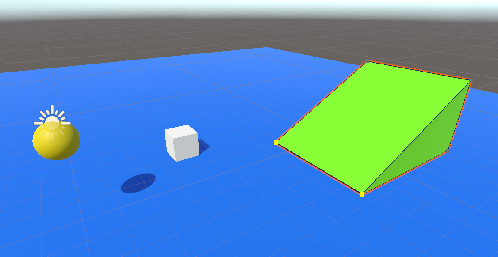
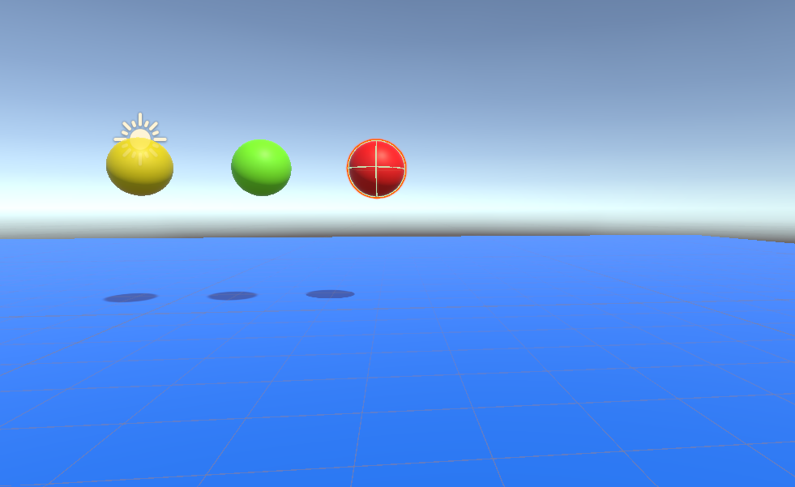

# Laboratorium \#4


# Fizyka 3D w Unity

Materiały związane z fizyką:

- wykład (dostępny na Teams)
- dokumentacja
  <https://docs.unity3d.com/2022.3/Documentation/Manual/PhysicsOverview.html>
- <https://github.com/SamuelAsherRivello/physics-for-unity> (chechout na
  commicie dla odpowiedniej wersji)

1.  Stwórz przykładową scenę zawierającą np. płaszczyznę, kilka kulek,
    kostek, równi pochyłych. Można podpiąć Probuilder oraz od razu Input
    System. Na niej dalej nie pracuj, do kolejnych punktów skopiuj
    (zduplikuj scenę).

Przykładowy widok:



2.  Zduplikuj kilka obiektów i ustaw je na tej samej wysokości względem
    płaszczyzny. Następnie pod każdy obiekt z tej samej wysokości dołacz
    Rigidbody z różnymi parametrami.



3.  Do kilku obiektów podepnij Rigidbody. W ustawieniach projektu
    (Projecy Settings) zmień wartość Gravity:


Na koniec zmień wartości na domyślne.

4.  Dla wybranych obiektów gry zmień warstwę na inną niż domyślną. Dla
    niektórych obiektów dodaj Rigidbody. Następnie sprawdź ustawienia
    Layer Collision Matrix. Na koniec przywróć wartości domyślne w tej
    macierzy.


5.  Sprawdź jak działa opcja edycji Colliderów:


6.  Zduplikuj kilka obiektów i ustaw je na tej samej wysokości względem
    płaszczyzny. Następnie pod każdy obiekt z tej samej wysokości dołacz
    Rigidbody z różnymi parametrami. Następnie każdy z obiektów powinien
    posiadać różne fizyczne materiałami z innymi ustawieniami.

7.  Na scenie z punkt 6 dodaj skrypt odpowiadający za wykrywanie kolizji
    do wybranych obiektów na wspólnej wysokości:

``` csharp
public class CollisionDetect : MonoBehaviour
{
    public void OnCollisionEnter(Collision collision)
    {
        Debug.Log("Collision Detected");
        Debug.Log(collision.gameObject.name);
    }

    void OnCollisionStay(Collision collision)
    {
        Debug.Log("Collision Detected");
        Debug.Log(collision.gameObject.name);
    }

    void OnCollisionExit(Collision collision)
    {
        Debug.Log("Collision Detected");
        Debug.Log(collision.gameObject.name);
    }

}
```

Co się zmienic jak Collision będzie zastąpione jako Trigger?

8.  Pod jeden z obiektów podepnij skrypt PlayerController z lab2:

``` csharp
using System.Collections;
using System.Collections.Generic;
using UnityEngine;
using UnityEngine.InputSystem;

public class PlayerController : MonoBehaviour
{
    private Rigidbody rb;
    private float movementX;
    private float movementY;
    public float speed = 5;

    void Start()
    {
        rb = GetComponent<Rigidbody>();
    }

    void OnMove(InputValue movementValue)
    {
        Vector2 movementVector = movementValue.Get<Vector2>();
        movementX = movementVector.x;
        movementY = movementVector.y;
    }

    void OnJump(InputValue movementValue)
    {
        rb.AddForce(Vector3.up * 5, ForceMode.Impulse);

    }
    private void FixedUpdate()
    {
        Vector3 movement = new Vector3(movementX, 0.0f, movementY);
        rb.AddForce(movement * speed);
    }
}
```

Potestuj zmiany różnych opcji argumentów w `AddForce`. Co się zmieni
przy użyciu `AddTorque`?

9.  Spróbuj połączyć kilka obiektów jednym rodzajem połączeń (ang.
    jointów) <https://docs.unity3d.com/Manual/joints-section.html>

## Zadanie dodatkowe (1-2 pkt)

Przygotowanie sceny w kształcie labiryntu. Na planszy należy umieścić
jakieś obiekty (na zasadzie dropów), które należy zebrać. Ilość
zebranych przedmiotów powinna być przechowywana w zmiennej w jednej z
klas i wyświetlana na konsoli. Projekt powinien wykorzystywać różne
opcje fizyczne w trakcie pokonywania labiryntu.
