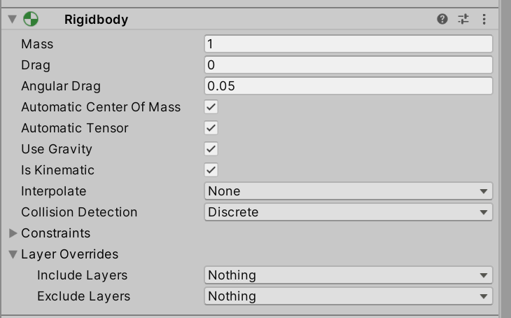

# Laboratorium \#5


# Fizyka 3D + podstawy kamery

Materiały związane z fizyką:

- wykład (dostępny na Teams)
- dokumentacja
  <https://docs.unity3d.com/2022.3/Documentation/Manual/PhysicsOverview.html>
- <https://github.com/SamuelAsherRivello/physics-for-unity> (chechout na
  commicie dla odpowiedniej wersji)

## Ćw.1. Most

Stwórz scenę zawierającą most bujany (wiszący) (testowanie Hinge
Jointów). Przykładowa konfiguracja:


- Płaszczyzna jako “podstawa ziemi”:


- Lewa podpora:


- Prawa podpora




- Środkowa deska na moście:


- Duplikuj kilka desek i rozmieść je by stanowiły odpowiednią
  konstrukcję mostu.

- Połącz od lewej do prawej pojedynczo kolejno elementy za pomocą Hinge
  Jointów i ustaw odpowiednio Connected Body.

- Dodaj kulkę na górę jednej z podpór (+podepnij skrypt do kulki z
  poprzedniego labu).

- Spróbuj dodać kilka opcji opcjonalnych dla Hinge Joint (dla wszystkich
  należy dokonać zmiany):


- Dla jednego z Hinge Joint potestuj zmianę parametru Break Force.

## Ćw.2. Ustawienia komponentu Kamery

- Potestuj modyfikację parametrów domyślnego komponentu Kamera.

## Ćw.3. `CharacterController`

Stwórz nową scenę.

1.  Podstawa


2.  Dodaj na scenę kapsułkę z CharacterController. Podebnij skrypt:

``` csharp
using UnityEngine;
using UnityEngine.InputSystem;

public class CapsuleController : MonoBehaviour
{
    public float speed = 5f;
    public float lookSpeed = 2f;
    public float jumpHeight = 2f;
    private CharacterController controller;
    private Vector3 velocity;
    private float gravity = -9.81f;
    private bool isGrounded;
    private Vector2 moveInput;
    private Vector2 lookInput;

    void Start()
    {
        controller = GetComponent<CharacterController>();
    }

    void Update()
    {
        // Sprawdzamy, czy postać stoi na ziemi
        isGrounded = controller.isGrounded;
        if (isGrounded && velocity.y < 0)
        {
            velocity.y = -2f;
        }

        // Ruch postaci na podstawie wartości moveInput
        Vector3 move = new Vector3(moveInput.x, 0, moveInput.y);
        // ew poprawka
        // Vector3 move = transform.TransformDirection(new Vector3(moveInput.x, 0, moveInput.y));
        controller.Move(move * speed * Time.deltaTime);

        // Obrót postaci (wokół osi Y)
        transform.Rotate(Vector3.up * lookInput.x * lookSpeed);

        // Grawitacja
        velocity.y += gravity * Time.deltaTime;
        controller.Move(velocity * Time.deltaTime);
    }

    private void OnMove(InputValue movementValue)
    {
        // Pobieramy dane ruchu (x i y) z wejścia
        moveInput = movementValue.Get<Vector2>();
    }

    private void OnJump(InputValue movementValue)
    {
        // Jeśli postać jest na ziemi, ustawiamy prędkość skoku
        if (isGrounded)
        {
            velocity.y = Mathf.Sqrt(jumpHeight * -2f * gravity);
        }
    }

    private void OnLook(InputValue lookValue)
    {
        lookInput = lookValue.Get<Vector2>();
    }

}
```

- Dodaj na scenę kilka obiektów i potestuj ustawienia
  CharacterController. Przyjmij zasadę: materiał lub tekstura zielona -
  obiekty, na które “można wejść”, materiał lub tekstura czerwona -
  obiekty, na które nie można wejść.


- Opcjonalnie można zmienić kamerę na FPS (kamera jako dziecko kapsułki,
  dla niej reset Transform).

- Dodaj kostkę Drzwi:


- Przed drzwiami z jednej strony dodaj Cube (wyłącznie z niego Mesh) i
  podepnij skrypt do podnoszenia drzwi:

``` csharp
using UnityEngine;

public class DoorController : MonoBehaviour
{
    public Transform door; // Drzwi, które mają się podnosić
    public float openHeight = 5f; // Wysokość, na którą drzwi się podniosą
    public float speed = 2f; // Prędkość otwierania/zamykania

    private Vector3 closedPosition;
    private Vector3 openPosition;
    private bool isOpening = false;

    void Start()
    {
        // Pozycja zamkniętych drzwi
        closedPosition = door.position;
        // Pozycja otwartych drzwi (przesunięcie w osi Y)
        openPosition = closedPosition + Vector3.up * openHeight;
    }

    void Update()
    {
        // Interpolacja pozycji drzwi w zależności od stanu isOpening
        if (isOpening)
        {
            door.position = Vector3.Lerp(door.position, openPosition, speed * Time.deltaTime);
        }
        else
        {
            door.position = Vector3.Lerp(door.position, closedPosition, speed * Time.deltaTime);
        }
    }

    // Wykrywanie kolizji wejścia do triggera
    private void OnTriggerEnter(Collider other)
    {
        if (other.CompareTag("Player"))
        {
            isOpening = true;
        }
    }

    // Wykrywanie kolizji wyjścia z triggera
    private void OnTriggerExit(Collider other)
    {
        if (other.CompareTag("Player"))
        {
            isOpening = false;
        }
    }
}
```

- Dodaj tag Player do kapsułki.

## Zadanie dodatkowe (1 pkt)

Przygotowanie sceny w kształcie trójwymiarowej platformy testującej
możliwości CharacterController.
