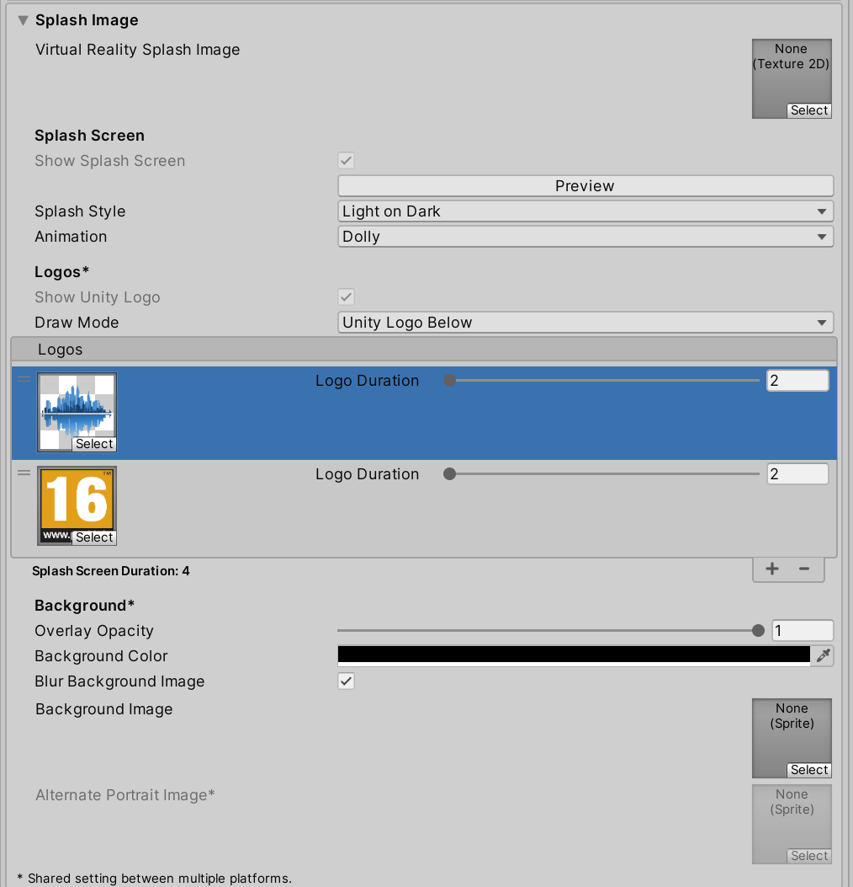
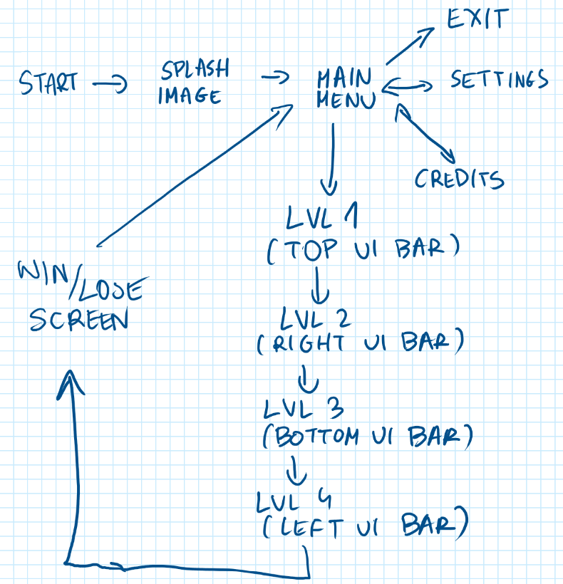

# Laboratorium \#6


# Podstawy interfejs użytkownika

Dodatkowe info:

- wykład
- <https://docs.unity3d.com/Packages/com.unity.ugui@1.0/manual/index.html>
- <https://docs.unity3d.com/Packages/com.unity.ugui@2.0/manual/TextMeshPro/index.html>

## Ćw.1. - Splash Image

1.  W ustawieniach projektu dodaj co najmniej jeden obrazek jako
    SplashImage.

Więcej info [splash_image.md](splash_image.md)



## Ćw.2. - Scena Menu

Stwórz scenę Menu i dodaj tam kilka przycisków. Potestuj różne
umiejscowieniem go względem pozycji, anchor, pivot. Skompiluj projekt
przy wybranych ustawieniach.

## Ćw.3. - Ustawienia

Umieść dotychczasowe przyciski na panelu (dalsze przyciski będą dziećmi
w hierarchii). Dodaj do przysisku ustawienia logikę tak, aby główny
panel znikał, a pojawiał się inny do sterowania ustawieniami.


``` csharp
    [SerializeField] private GameObject mainPanel;
    [SerializeField] private GameObject settingsPanel;
    public void SettingsPanelActivate()
    {
        mainPanel.SetActive(false);
        settingsPanel.SetActive(true);
    }
```

## Ćw.3. - Ustawienia cz.2.

Stwórz prostą logikę do sterowania ustawieniami np. rozdzielczością (ale
mogą być inne opcje). Upewnij się, ze masz zaimplementowany powrót to
głównego menu.

``` csharp
using System.Collections.Generic;
using TMPro;
using UnityEngine;
using UnityEngine.UI;

public class ResolutionChanger : MonoBehaviour
{
    private TMP_Dropdown resolutionDropdown;
    private Resolution[] resolutions;

    void Start()
    {
        resolutionDropdown = GetComponent<TMP_Dropdown>();
        // Pobieranie dostępnych rozdzielczości
        resolutions = Screen.resolutions;
        resolutionDropdown.ClearOptions();

        // Konwertowanie rozdzielczości na listę do Dropdown
        List<string> options = new List<string>();
        int currentResolutionIndex = 0;

        for (int i = 0; i < resolutions.Length; i++)
        {
            string option = resolutions[i].width + " x " + resolutions[i].height;
            options.Add(option);

            // Sprawdzenie, czy bieżąca rozdzielczość jest zgodna z aktualną rozdzielczością ekranu
            if (resolutions[i].width == Screen.currentResolution.width &&
                resolutions[i].height == Screen.currentResolution.height)
            {
                currentResolutionIndex = i;
            }
        }

        resolutionDropdown.AddOptions(options);
        resolutionDropdown.value = currentResolutionIndex; // Ustawienie domyślnego wyboru
        resolutionDropdown.RefreshShownValue(); // Odświeżenie widocznej wartości

        resolutionDropdown.onValueChanged.AddListener(ChangeResolution);
    }

    public void ChangeResolution(int index)
    {
        Resolution selectedResolution = resolutions[index];
        Screen.SetResolution(selectedResolution.width, selectedResolution.height, Screen.fullScreen);
    }
}
```

## Ćw.4. - Credits

Dodaj panel z creditsami, do którego można wejśc z menu.

- dodaj panel
- na panel Dodaj Scroll View - ustal jego rozmiar jak potrzeba.
- usuń horizontal scrollbar z hierarchii. Odhacz tez dla ScrollView
  horizontal.

Po tym powinno być mniej więcej:


- Zmień parametry obiektu Content. W Rect Transform wobec obu osi ustaw
  scretch. Dodaj komponent TextMeshPro - Text (UI). W Extra Setting
  ustaw marginesy. Dodaj komponent Content Size Fitter.

Przykładowa składnia Credits (wygenerowania przez AI):

``` text
<align=center><b><size=36>Game Credits</size></b></align>

<align=center><size=28><b>Development Team</b></size></align>
<color=#FFD700>Director:</color> <b>Jane Doe</b>
<color=#FFD700>Lead Programmer:</color> <b>John Smith</b>
<color=#FFD700>Art Director:</color> <b>Alice Johnson</b>
<color=#FFD700>Game Designer:</color> <b>Michael Brown</b>

<align=center><size=28><b>Programming</b></size></align>
<b>Backend Developer:</b> Emily Davis
<b>Frontend Developer:</b> Robert Wilson
<b>Tools Programmer:</b> Linda White
<b>AI Programmer:</b> Steve Adams

<align=center><size=28><b>Art & Design</b></size></align>
<b>3D Artist:</b> Sarah Taylor
<b>2D Illustrator:</b> Chris Thompson
<b>UI/UX Designer:</b> Angela Moore
<b>Animator:</b> David King

<align=center><size=28><b>Sound & Music</b></size></align>
<b>Composer:</b> Brian Lee
<b>Sound Designer:</b> Megan Scott
<b>Voice Acting Director:</b> Rebecca Young

<align=center><size=28><b>Quality Assurance</b></size></align>
<b>QA Lead:</b> James Walker
<b>QA Tester:</b> Laura Turner
<b>QA Tester:</b> Kevin Phillips
<b>QA Tester:</b> Rachel Nelson

<align=center><size=28><b>Special Thanks</b></size></align>
To all our families and friends for their support!
<color=#00FF00><link="https://www.supportersite.com">Support Us</link></color>

<align=center><size=20><b>Visit Our Website</b></size></align>
<color=#0000FF><link="https://www.ourgame.com">www.ourgame.com</link></color>

<color=#FF4500>Environment Pack:</color> <b>Fantasy Forest Set</b> by <i>ABC Studios</i> (License: Commercial)  
Website: <link="https://www.abcstudios.com">abcstudios.com</link> | Downloaded on: 15 March 2023

<color=#FF4500>Character Models:</color> <b>Hero Pack</b> by <i>XYZ Creations</i> (License: Royalty-Free)  
Website: <link="https://www.xyzcreations.com">xyzcreations.com</link> | Downloaded on: 2 February 2023

<color=#32CD32>Animation Set:</color> <b>Ultimate Animation Bundle</b> by <i>Animaster</i> (License: Unity Asset Store Standard)  
Website: <link="https://www.animaster.com">animaster.com</link> | Downloaded on: 10 January 2023

<color=#32CD32>UI Elements:</color> <b>Sleek UI Kit</b> by <i>DesignWorks</i> (License: Open Source)  
Website: <link="https://www.designworks.com">designworks.com</link> | Downloaded on: 20 June 2023

<color=#1E90FF>Particle Effects:</color> <b>Magic VFX Pack</b> by <i>VisualFX Labs</i> (License: Limited Use)  
Website: <link="https://www.visualfxlabs.com">visualfxlabs.com</link> | Downloaded on: 5 July 2023

<color=#1E90FF>Audio Pack:</color> <b>Epic Soundtrack Collection</b> by <i>SoundScape</i> (License: Personal Use Only)  
Website: <link="https://www.soundscapeaudio.com">soundscapeaudio.com</link> | Downloaded on: 22 April 2023

<color=#FFA500>Sound Effects:</color> <b>Realistic Foley</b> by <i>NoiseWorks</i> (License: Creative Commons)  
Website: <link="https://www.noiseworks.com">noiseworks.com</link> | Downloaded on: 10 May 2023

<color=#8A2BE2>Voice Acting Assets:</color> <b>VoiceMaster Toolkit</b> by <i>VocalPros</i> (License: Commercial)  
Website: <link="https://www.vocalpros.com">vocalpros.com</link> | Downloaded on: 8 August 2023

<color=#DC143C>Shaders:</color> <b>Stylized Water Shader</b> by <i>ShaderCraft</i> (License: Asset Store Exclusive)  
Website: <link="https://www.shadercraft.com">shadercraft.com</link> | Downloaded on: 17 March 2023

<color=#FF6347>Lighting Effects:</color> <b>Dynamic Light Set</b> by <i>IllumiTech</i> (License: Unity Pro)  
Website: <link="https://www.illumitech.com">illumitech.com</link> | Downloaded on: 30 September 2023

```


- Dodaj skrypt nadający kliklność linków:

``` csharp
using TMPro;
using UnityEngine;
using UnityEngine.EventSystems;

public class CreditsLinkHandler : MonoBehaviour, IPointerClickHandler
{
    private TMP_Text textMeshPro;

    void Start()
    {
        textMeshPro = GetComponent<TMP_Text>();
    }

    public void OnPointerClick(PointerEventData eventData)
    {
        // Znajdowanie klikniętego linku
        int linkIndex = TMP_TextUtilities.FindIntersectingLink(textMeshPro, Input.mousePosition, null);
        if (linkIndex != -1)
        {
            TMP_LinkInfo linkInfo = textMeshPro.textInfo.linkInfo[linkIndex];
            string url = linkInfo.GetLinkID();
            Application.OpenURL(url);
        }
    }
}
```

- Można poprawić esetetykę prawo scrola. Pozycja RectTransform + lekkie
  ręczne przesunięcie.


## Ćw.5. - Nawigacja do kolejnych scen

Dodaj do projektu nawigację do kolejnych scen. Upewnij się, że sceny są
ujęte w Build Setting.

``` csharp
// Metoda do ładowania sceny o nazwie
    public void LoadSceneByName(string sceneName)
    {
        SceneManager.LoadScene(sceneName);
    }

    // Metoda do ładowania sceny po jej indeksie
    public void LoadSceneByIndex(int sceneIndex)
    {
        SceneManager.LoadScene(sceneIndex);
    }
```

## Ćw.6. Wyjście

Dodaj obsługę wyjścia z aplikacji za pomocą `Application.Quit()`.

## Zadanie dodatkowe (1-2 pkt)

Zaimplementuj mały projekt testując komponenty UI na bazie przykładowego
GameFlow:


