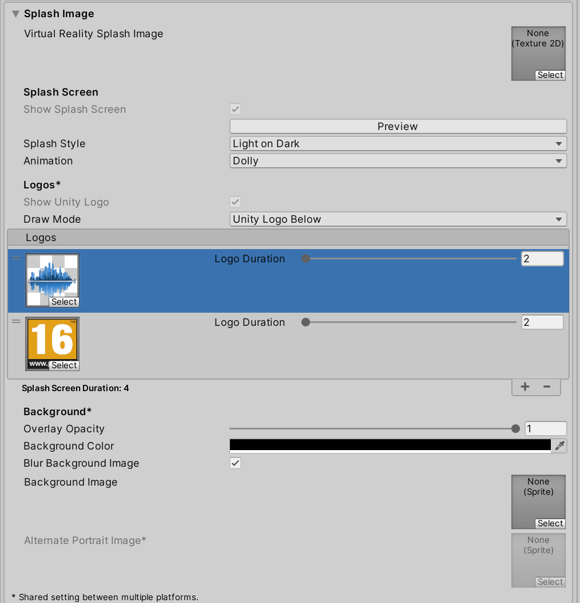

# Splash Image

Splash Image to grafika, która wyświetla się podczas uruchamiania
aplikacji lub gry. W przypadku Unity, Splash Image jest początkowym
ekranem, który użytkownicy widzą, zanim zostanie wczytany główny ekran
aplikacji. Często służy jako branding dla aplikacji i może zawierać logo
firmy, nazwę gry lub inne elementy graficzne. W wersjach Personal Unity
domyślnie wyświetlany jest ekran „Made with Unity”.

### Dobre praktyki przy tworzeniu Splash Image w Unity:

1.  **Zachowanie prostoty**: Splash Image powinien być czytelny,
    przejrzysty i szybko rozpoznawalny. Unikaj zbyt dużej liczby detali,
    które mogą przytłoczyć użytkownika.

2.  **Odpowiednie wymiary i rozdzielczość**: Upewnij się, że grafika ma
    odpowiednią rozdzielczość, aby uniknąć rozmycia lub zniekształceń na
    różnych urządzeniach. Wysokiej jakości obraz dostosowany do różnych
    ekranów (np. HD, 4K) jest ważny dla dobrego pierwszego wrażenia.

3.  **Optymalizacja pod kątem czasu ładowania**: Splash Image powinien
    być lekki i szybki do załadowania. Zbyt duża lub skomplikowana
    grafika może zwiększyć czas ładowania i negatywnie wpłynąć na
    doświadczenie użytkownika.

4.  **Spójność z marką i stylem aplikacji**: Używaj kolorów, czcionek i
    innych elementów graficznych, które pasują do całej aplikacji lub
    gry. Dzięki temu Splash Image będzie integralną częścią
    doświadczenia użytkownika.

5.  **Płynne przejścia**: Rozważ dodanie subtelnych efektów przejścia,
    aby Splash Image gładko przechodził do głównego menu lub ekranu
    ładowania. Może to być np. stopniowe zanikanie lub inny efekt, który
    wzbogaci wrażenia użytkownika.

6.  **Krótkie wyświetlanie**: Splash Image powinien być widoczny na
    krótko, zazwyczaj przez 2–5 sekund. Zbyt długie oczekiwanie na
    załadowanie głównego ekranu może być irytujące.

7.  **Testowanie na różnych urządzeniach**: Przetestuj Splash Image na
    różnych rozdzielczościach ekranów i urządzeniach, aby upewnić się,
    że wygląda dobrze niezależnie od platformy (PC, mobilne, konsole).

8.  **Dostosowanie w ustawieniach Unity**: Unity oferuje opcje
    konfigurowania Splash Image, w tym możliwość włączenia
    niestandardowej animacji, zmiany tła lub dodania logotypów. Warto
    zapoznać się z tymi opcjami i dostosować ekran startowy do własnych
    potrzeb.

Zmiana dokonywana jest w ustawieniach projektu w Player Setting:

