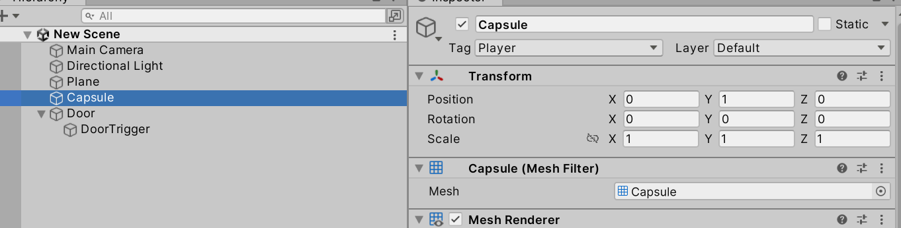

# Laboratorium \#8


# Animacja

- Wykład
- Animation Clip <https://docs.unity3d.com/Manual/AnimationClips.html>
- Animator
  <https://docs.unity3d.com/Manual/class-AnimatorController.html>

## Ćw.1

Odtwórz z wykładu animację spadającej i odbijającej się sprężyście
kulki.

Przykładowe ustawienia:


## Ćw.2.

Uzupełnij animację o rozciąganie kulki w pionie, gdy jest w swojej
maksymalnej wysokości.

## Ćw.3.

Odtwórz z wykładu scenę z animatorem i podnoszonymi drzwiami.

Obiekty:





Skrypt do poruszania się charakter kontrollera:

``` csharp
using UnityEngine;
using UnityEngine.InputSystem;

public class CapsuleController : MonoBehaviour
{
    public float speed = 5f;
    public float lookSpeed = 2f;
    public float jumpHeight = 2f;
    private CharacterController controller;
    private Vector3 velocity;
    private float gravity = -9.81f;
    private bool isGrounded;
    private Vector2 moveInput;
    private Vector2 lookInput;

    void Start()
    {
        controller = GetComponent<CharacterController>();
    }

    void Update()
    {
        // Sprawdzamy, czy postać stoi na ziemi
        isGrounded = controller.isGrounded;
        if (isGrounded && velocity.y < 0)
        {
            velocity.y = -2f;
        }

        // Ruch postaci na podstawie wartości moveInput
        Vector3 move = new Vector3(moveInput.x, 0, moveInput.y);
        // ew poprawka
        //Vector3 move = transform.TransformDirection(new Vector3(moveInput.x, 0, moveInput.y));
        controller.Move(move * speed * Time.deltaTime);

        // Obrót postaci (wokół osi Y)
        transform.Rotate(Vector3.up * lookInput.x * lookSpeed);

        // Grawitacja
        velocity.y += gravity * Time.deltaTime;
        controller.Move(velocity * Time.deltaTime);
    }

    private void OnMove(InputValue movementValue)
    {
        // Pobieramy dane ruchu (x i y) z wejścia
        moveInput = movementValue.Get<Vector2>();
    }

    private void OnJump(InputValue movementValue)
    {
        // Jeśli postać jest na ziemi, ustawiamy prędkość skoku
        if (isGrounded)
        {
            velocity.y = Mathf.Sqrt(jumpHeight * -2f * gravity);
        }
    }

    private void OnLook(InputValue lookValue)
    {
        lookInput = lookValue.Get<Vector2>();
    }

}
```

Ustawienia Animatora (podpięty pod obiekt Door):


Warunki przejść:


Skrypt do sterowania animacją (podpięty pod DoorTrigger)

``` csharp
using UnityEngine;
using System.Collections;

public class DoorController : MonoBehaviour {

    private Animator anim;
    void Start()
    {
        anim = this.transform.parent.GetComponent<Animator>();
    }
    
    void OnTriggerEnter(Collider obj)
    {
        anim.SetBool("isOpen", true);
    }

    void OnTriggerExit(Collider obj)
    {
        anim.SetBool("isOpen", false);
    }
}
```

## Zadanie dodatkowe (1-2 pkt)

Przygotowanie małej sceny trójwymiarowej demonstrującej działania
Animatora według własnego pomysłu.
