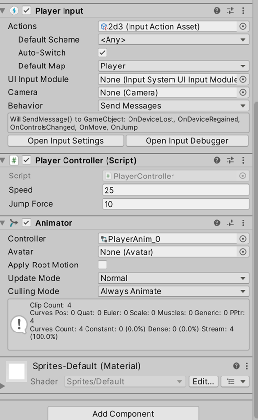
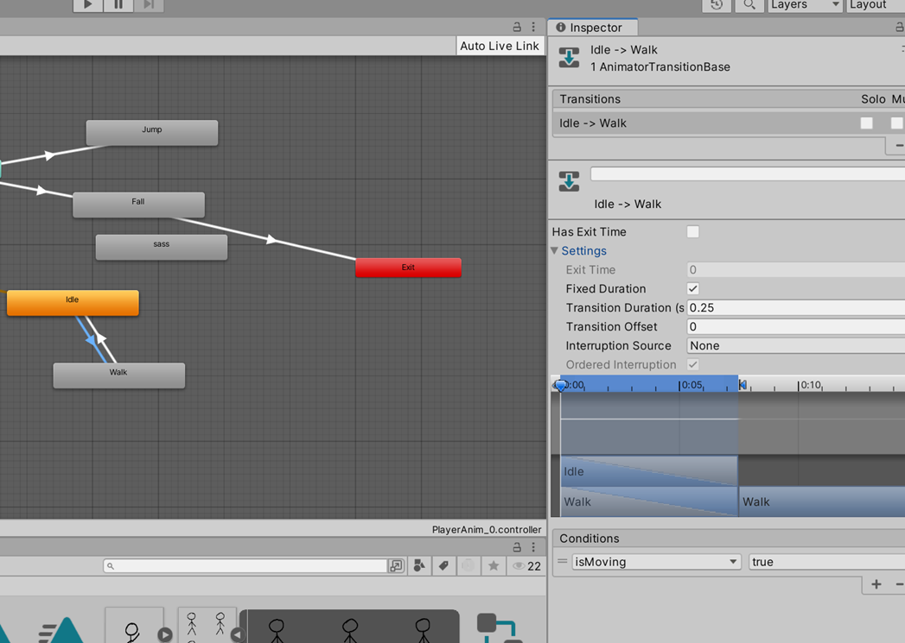

# Laboratorium \#9


# Gra 2D

Cel: otworzenie prostej mechaniki 2D z wykładu.

## Ćw.1 - Przygotowanie spritów

- https://www.piskelapp.com/ (rozmiar 400x400, export jako png)
- lub
  https://github.com/gljmelton/UnityAnimatorDemo/tree/master/Assets/Player
- https://itch.io/game-assets/free/tag-sprites

## Ćw.2. - Import obrazków do Unity

- Dodaj obrazki do assetów.
- Ustaw ich tryb na Multiple.


- Podziel je ręcznie w sprite editor.


## Ćw.3. - ustawienia gracza

- Na bazie zdjęć ustaw gracza.
- zmodyfikuj box collider 2D
- zablokuj rotację Z w Rigidbody 2D




## Ćw.4. - redukacja w akcjach w input system

Uprość akcje w Input System i dodaj skok (i zmapuj spację):


## Ćw.5.

Dodaj coś jako postawę (ziemię lub trawę).

## Ćw.6. - Skrypt podstawowy

Dodaj skrypt do poruszania się:

``` csharp
using System;
using System.Collections;
using System.Collections.Generic;
using UnityEngine;
using UnityEngine.InputSystem;
public class PlayerController : MonoBehaviour
{
    public float speed = 10.0f;
    public float jumpForce = 10.0f;
    private Rigidbody2D playerRb;
    private Vector2 horizontalInput;
    private SpriteRenderer sprite;


    void Start()
    {
        playerRb = GetComponent<Rigidbody2D>();
        sprite = GetComponent<SpriteRenderer>();
    }
    void OnMove(InputValue inputValue)
    {
        horizontalInput = inputValue.Get<Vector2>();
        if (horizontalInput.x < 0)
        {
            sprite.flipX = true;
        }
        else
        {
            sprite.flipX = false;
        }
    }
    void OnJump(InputValue input)
    {
        playerRb.AddForce(Vector2.up * jumpForce, ForceMode2D.Impulse);
    }
    private void FixedUpdate()
    {
        playerRb.AddForce(Vector2.right * speed * horizontalInput.x);
    }
}
```

## Ćw.7.

Dodaj animację wzajemną między dwoma stanami np. Idle i Walk

``` csharp
using System;
using System.Collections;
using System.Collections.Generic;
using UnityEngine;
using UnityEngine.InputSystem;
public class PlayerController : MonoBehaviour
{
    public float speed = 10.0f;
    public float jumpForce = 10.0f;
    private Rigidbody2D playerRb;
    private Vector2 horizontalInput;
    private SpriteRenderer sprite;
    private Animator anim;
    private bool isMoving = false;

    void Start()
    {
        playerRb = GetComponent<Rigidbody2D>();
        sprite = GetComponent<SpriteRenderer>();
        anim = GetComponent<Animator>();
    }
    void OnMove(InputValue inputValue)
    {
        horizontalInput = inputValue.Get<Vector2>();
        if (horizontalInput.x < 0)
        {
            sprite.flipX = true;
        }
        else
        {
            sprite.flipX = false;
        }
        isMoving = horizontalInput != Vector2.zero;
        anim.SetBool("isMoving", isMoving);
    }
    void OnJump(InputValue input)
    {
        playerRb.AddForce(Vector2.up * jumpForce, ForceMode2D.Impulse);
    }
    private void FixedUpdate()
    {
        playerRb.AddForce(Vector2.right * speed * horizontalInput.x);
    }
}
```





## Ćw.8.

Dodaj pozostałe animacje

``` csharp
using System;
using System.Collections;
using System.Collections.Generic;
using UnityEngine;
using UnityEngine.InputSystem;
public class PlayerController : MonoBehaviour
{
    public float speed = 10.0f;
    public float jumpForce = 10.0f;
    private Rigidbody2D playerRb;
    private Vector2 horizontalInput;
    private SpriteRenderer sprite;
    private Animator anim;
    private bool isMoving = false;

    void Start()
    {
        playerRb = GetComponent<Rigidbody2D>();
        sprite = GetComponent<SpriteRenderer>();
        anim = GetComponent<Animator>();
    }
    void OnMove(InputValue inputValue)
    {
        horizontalInput = inputValue.Get<Vector2>();
        if (horizontalInput.x < 0)
        {
            sprite.flipX = true;
        }
        else
        {
            sprite.flipX = false;
        }
        isMoving = horizontalInput != Vector2.zero;
        anim.SetBool("isMoving", isMoving);
    }
    void OnJump(InputValue input)
    {
        playerRb.AddForce(Vector2.up * jumpForce, ForceMode2D.Impulse);
        anim.SetTrigger("jump");
    }
    private void FixedUpdate()
    {
        playerRb.AddForce(Vector2.right * speed * horizontalInput.x);
        anim.SetFloat("vspeed", playerRb.velocity.y);
    }
}
```


## Zadanie dodatkowe (1-2 pkt)

Przygotuj prostą grę platformową 2D poleagającą na zbieraniu monet przez
gracza. Wyniki wyświetl na UI.
